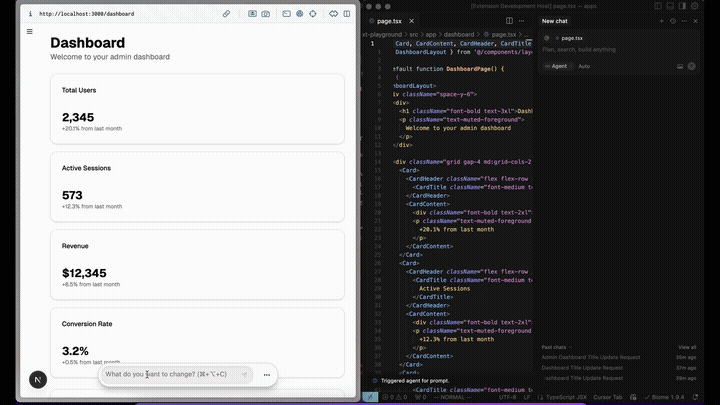

#  stagewise

### Eyesight for your local AI-Agent.

[](https://marketplace.visualstudio.com/items?itemName=YOUR_PUBLISHER_NAME.stagewise-vscode) [](https://github.com/stagewise-io/stagewise/actions) [](https://opensource.org/licenses/MIT) [](https://github.com/stagewise-io/stagewise) 



## What is stagewise? 🤔

With stagewise, you can **comment on elements** and your local dev agent will automatically **receive a change-prompt with context.**

👆🏽 💬 *Make this button green!!!* ...  🧙🏽 🪄 🟢

## Quickstart 📖

### 1. 🧩 **Install the vs-code extension** 

Install the extension here: https://google.com

> [!NOTE]
> 💬 **Enable MCP support (Cursor):** 
> - The extension will auto-install a **stagewise MCP server**.
> - Cursor will prompt you to *enable* the server.
> - Click *enable* to let your agent call MCP-tools that the toolbar provides. ([Read more](#write-custom-mcp-tools))

### 2. 👨🏽‍💻 **Install and inject the toolbar**

Install [@stagewise/toolbar]():
```bash
pnpm i -D @stagewise/toolbar
```

Inject the toolbar into your app dev-mode:
```tsx
'use client';
import { initToolbar, type ToolbarConfig } from '@stagewise/toolbar';
import { useEffect, useRef } from 'react';

export default function ToolbarWrapper({ config }: { config: ToolbarConfig }) {
  const isLoaded = useRef(false);
  useEffect(() => {
    if (isLoaded.current) return;
    isLoaded.current = true;
    initToolbar(config);
  }, []);
  return null;
}
```

## Features 🔥

* 👆🏽 **Visual Element Selection:** Target UI elements directly in your running app.
* 💬 **Natural Language Commands:** Talk to your code like you talk to a teammate.
* 🤖 **Context for your agent:** Automatically send rich browser context (DOM, styles, state) for more accurate AI suggestions.
* 👨🏽‍💻 **Local IDE Integration:** Seamlessly connects to AI agents within VS Code.
* ⬅️➡️ **Bidirectional Communication:** The agent can query the toolbar via [MCP](https://modelcontextprotocol.io/).
* 📖 **Open Source:** Built by developers, for developers. Contribute and shape the future!

## Agent support 🤖

| **Agent** | **Supported** |
| --- | --- |
| Cursor | ✅ |
| Copilot | ❌ |
| Windsurf | ❌ |
| Cline | ❌ |
| BLACKBOXAI | ❌ |
| Console Ninja | ❌ |
| Continue.dev | ❌ |
| Amazon Q | ❌ |
| Cody | ❌ |
| Qodo | ❌ |

## Advanced guides 🧪

### Write custom MCP tools

Simply write custom MCP-tools that run in your browser. Tools will automatically be registered and your local AI agent can use them: You just have to plug them into the toolbar config.

```typescript
// TBD
```

## Contributing 🤝

We're just getting started and love contributions! Check out our [CONTRIBUTING.md](https://github.com/stagewise-io/stagewise/blob/main/CONTRIBUTING.md) guide to get involved. Found a bug or have a feature idea? [Open an issue!](https://github.com/stagewise-io/stagewise/issues) 

## Community & Support 💬

* Join our [Discord](https://discord.gg/vsDjhubRbh)
* Leave a star on the [GitHub repo](https://github.com/stagewise-io/stagewise)

## License 📜

<!-- stagewise is open-source and licensed under the [MIT License](https://github.com/stagewise-io/stagewise/blob/main/LICENSE). --- -->
UNLICENSED, the license is under development.

*Made with ❤️ by the stagewise team.*